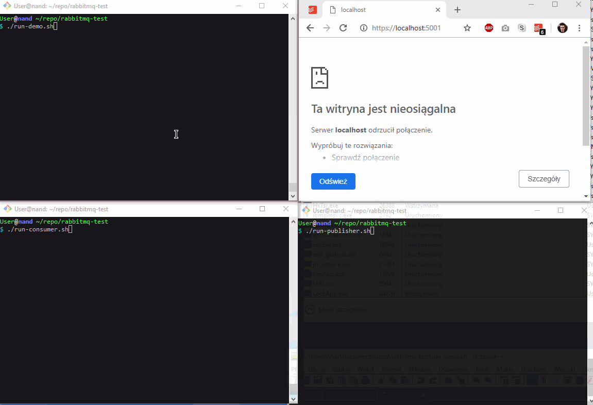
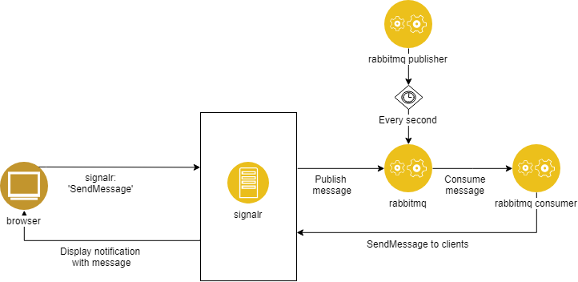

# rabbitmq-demo
This project is intended to show the rabbitmq capabilities with a connection to SignalR Hub.


Below the demo of this application in real time.


## Architecture



## Requirements

.NET Core 2.1 SDK

## How to run?

Execute below commands in the separare terminals:
```
./run-demo.sh
```
```
./run-consumer.sh
```
```
./run-publisher.sh
```
